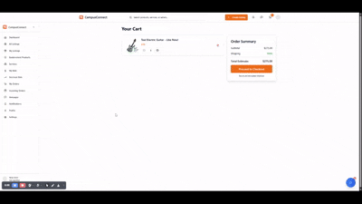
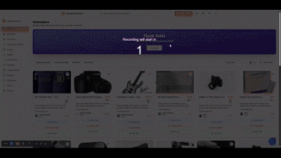
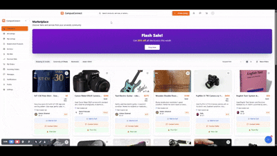

<p align="center">
  
</p>

<h1 align="center">CampusConnect</h1>

<p align="center">
  <strong>Your University Community Marketplace</strong><br/>
  Discover, buy, sell, and connect. Built by students, for students.
</p>

<p align="center">
  <!-- Optional: Add badges here e.g. build status, license, etc. -->
  <!--  -->
  <!--  -->
</p>

---

CampusConnect is a peer-to-peer marketplace platform designed exclusively for university communities. It facilitates the buying, selling, and trading of items and services among students, enhanced with AI-powered features to make the experience seamless and intuitive.

## ✨ Features


<summary><strong>🤖 AI-Powered Chatbot Assistant</strong></summary>
<br/>
Effortlessly find what you're looking for! Our intelligent chatbot understands natural language queries and helps you discover items and services quickly.
<p align="center">
  
</p>


<summary><strong>🛒 Streamlined Buying & Checkout</strong></summary>
<br/>
Browse diverse listings, add items to your cart, and complete your purchase securely. Track your orders and manage your bids with ease.
<p align="center">
  
</p>


<summary><strong>📝 Smart Listing Creation with AI</strong></summary>
<br/>
Selling made simple! Upload an image, and our AI Image Analyzer automatically suggests a title, description, category, and condition. The Price Advisor also recommends a fair market price based on similar listings.
<p align="center">
  
</p>


<summary><strong>📊 Comprehensive User Dashboard</strong></summary>
<br/>
Manage all your CampusConnect activities from one place:
<ul>
  <li>View and filter all marketplace listings.</li>
  <li>Manage your personal listings and received bids.</li>
  <li>Track your placed bids and purchased orders.</li>
  <li>Communicate with other users via built-in messaging.</li>
  <li>Stay updated with notifications.</li>
  <li>Customize your profile and settings.</li>
</ul>
<p align="center">

 
</p>


## 🚀 Getting Started

There are a few ways to get started with developing or contributing to CampusConnect:

### 1. Use your preferred IDE (Local Development)

The only requirement is having Node.js & npm installed - [install with nvm](https://github.com/nvm-sh/nvm#installing-and-updating)

Follow these steps:

```sh
# Step 1: Clone the repository. Replace <YOUR_GIT_URL> with the actual Git URL.
git clone <YOUR_GIT_URL>

# Step 2: Navigate to the project directory. Replace <YOUR_PROJECT_NAME> with your project's folder name.
cd <YOUR_PROJECT_NAME>

# Step 3: Install the necessary dependencies.
npm i

# Step 4: Start the development server with auto-reloading and an instant preview.
npm run dev
```

Your application should now be running, typically at `http://localhost:5173` (Vite's default) or as specified in your console.

### 2. Edit a file directly in GitHub

*   Navigate to the desired file(s) in the repository.
*   Click the "Edit" button (pencil icon) at the top right of the file view.
*   Make your changes and commit them directly.

### 3. Use GitHub Codespaces

*   Navigate to the main page of your repository.
*   Click on the "Code" button (green button) near the top right.
*   Select the "Codespaces" tab.
*   Click on "New codespace" to launch a new Codespace environment.
*   Edit files directly within the Codespace and commit and push your changes once you're done.

## 🛠️ Technologies Used

This project is built with a modern tech stack:

*   **[Vite](https://vitejs.dev/):** Next-generation frontend tooling.
*   **[TypeScript](https://www.typescriptlang.org/):** Superset of JavaScript that adds static typing.
*   **[React](https://reactjs.org/):** A JavaScript library for building user interfaces.
*   **[shadcn-ui](https://ui.shadcn.com/):** Beautifully designed components built with Radix UI and Tailwind CSS.
*   **[Tailwind CSS](https://tailwindcss.com/):** A utility-first CSS framework.

## 🤝 Contributing

Contributions are welcome! If you'd like to contribute, please follow these steps:
1. Fork the repository.
2. Create a new branch (`git checkout -b feature/YourAmazingFeature`).
3. Make your changes.
4. Commit your changes (`git commit -m 'Add some AmazingFeature'`).
5. Push to the branch (`git push origin feature/YourAmazingFeature`).
6. Open a Pull Request.

Please make sure to update tests as appropriate.

## 📄 License

This project is licensed under the [MIT License](LICENSE.md).
<!-- 
  If you don't have a LICENSE.md file yet, you can create one.
  Alternatively, state your license directly, e.g.:
  This project is licensed under the MIT License.
-->

---
<p align="center">Happy Connecting!</p>
